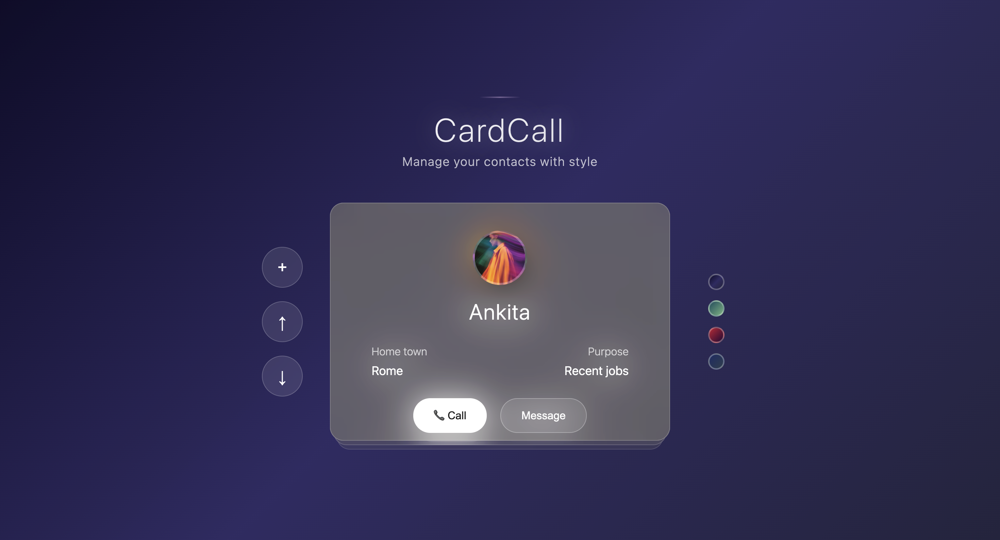
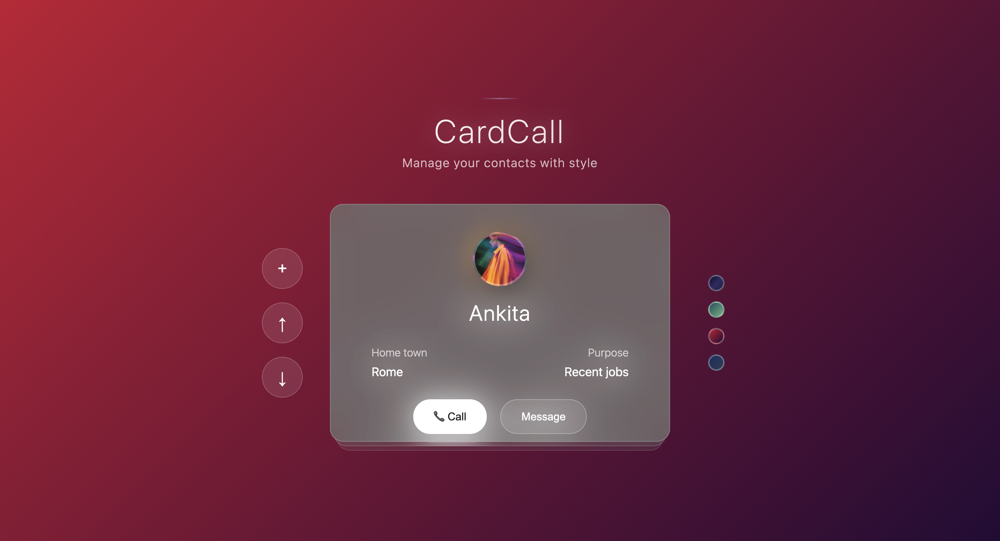
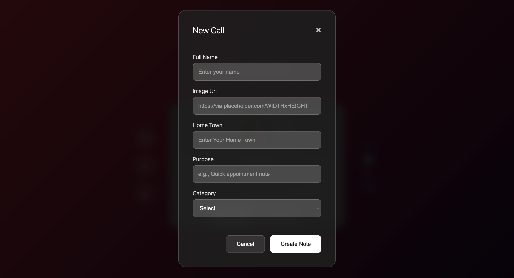
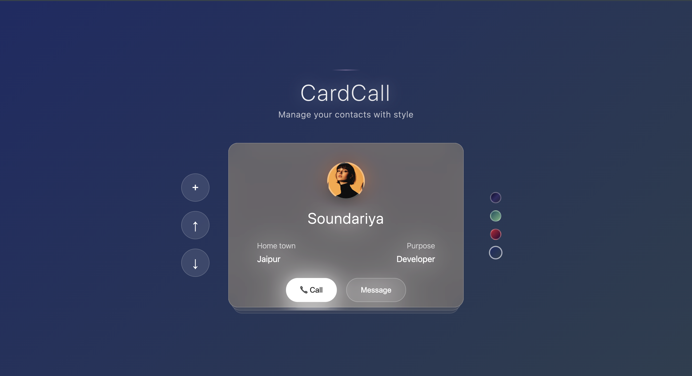

# 📇 CardCall - Contact Manager

CardCall is a modern web app that helps you **create, organize, and manage contacts** in a beautiful card-style UI.  
It is built using **HTML, CSS, and JavaScript** with **localStorage** support, so your data is saved directly in the browser.

---

## 🚀 Features
- ➕ Add contact cards with:
  - Full Name
  - Profile Image URL
  - Hometown
  - Purpose/Note
  - Category (Work, Personal, Important, Urgent)
- 🎨 Stylish **glassmorphism card design**
- ⬆️⬇️ **Card navigation** with up/down buttons
- 🌈 **Theme customization** with gradient color schemes
- 🖥️ Smooth modal animations
- 💾 Contacts saved in **Local Storage** (no backend required)
- 📱 Mobile responsive design

---

## 📸 Preview

### 🏠 Home Screen

### ➕ Add New Contact

### 🎨 Gradient Themes

---

## 🖼️ Demo
👉 [Live Demo on Netlify](https://your-netlify-link.netlify.app) *(add after deployment)*

---

## 📂 Project Structure
